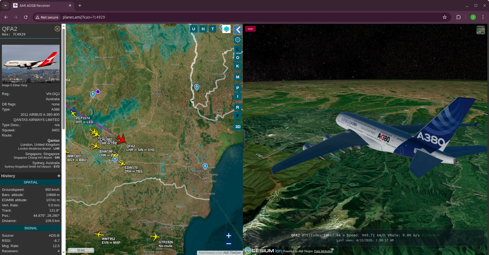

# tar1090 with Cesium 3D

This is a work in progress.

This repository is an advanced fork of the original tar1090 project by wiedehopf (<https://github.com/wiedehopf/tar1090>), extending the well-known ADS-B web interface with a dedicated 3D flight view powered by Cesium. It keeps the core strengths of tar1090 for real-time aircraft monitoring while adding a richer spatial perspective for tracking aircraft movement, orientation, altitude changes, and nearby traffic context in a globe-capable rendering environment.

The project is extensive in scope and combines multiple operational layers: decoder integration workflows, web serving and reverse-proxy configuration, front-end rendering modules, map and track presentation logic, aircraft metadata/database handling, optional history and persistence paths, and 3D model/terrain pipelines. In practical terms, this is not just a visual skin; it is a broad system that links receiver data flow, backend/runtime configuration, and complex browser-side behavior into a single platform for serious ADS-B visualization.

Warning: this software requires extensive technical knowledge to use correctly and safely. You should be comfortable with Linux system administration, decoder/service operations, networking, web server configuration, JavaScript configuration and debugging, and performance troubleshooting across both backend and frontend components; incorrect setup can lead to broken views, stale tracking, high resource use, or service conflicts with existing ADS-B installations.

For advanced users, this fork offers a powerful base for building a highly customized local or networked tracking stack with both high-density 2D monitoring and immersive Cesium-based 3D situational views. The code is offered as-is, no support is provided, and it is distributed under the GPL-3.0.

Clone this repo, study the code, change the maps with you providers and have fun with it! The code is tailored for my local develpoment, so you have to massive edit the config files (config.js, layers.js, etc.). Good knowledge about readsb (<https://github.com/wiedehopf/readsb>) is also required. But finally you'll have an website that displays live aircrafts with a 3D View.

I will answer to issues when I have time and if I consider the question asked to be worthy answering. No feature requests will be answered; if you want some new feature, write them yourself, but consider sharing it with the community.

Comercial use is permitted only if the original source is specified.

## Install

Starting point:

- Replace the original html directory in the tar1090 installation (backup first!) with the html from this repo;
- Edit layers.js and delete or add maps;
- Rename 3d.config.local.example.js to 3d.config.local.js and add your Cesium Ion key;
- Edit in config.js routeApiUrl and put your own value;
- Edit script.js and remove lines 622 and 645 and uncomment the next lines;

## Credits

### Upstream project

- **[readsb](https://github.com/wiedehopf/readsb)** by wiedehopf - the ADS-B decoder swiss knife (GPL-2.0+)
- **[tar1090](https://github.com/wiedehopf/tar1090)** by wiedehopf — the 2D ADS-B interface this project is forked from (GPL-2.0+)
- **[dump1090](https://github.com/flightaware/dump1090)** — `dbloader.js` (GPL-2.0+)

### 3D engine

- **[CesiumJS](https://cesium.com)** v1.140 — Apache 2.0

### 2D mapping

- **[OpenLayers](https://openlayers.org)** v10 — BSD 2-Clause
- **[ol-layerswitcher](https://github.com/walkermatt/ol-layerswitcher)** — MIT
- **[ol-ext](https://github.com/Viglino/ol-ext)** v4.0.21 by Jean-Marc Viglino — BSD 3-Clause
- **[ol-mapbox-style (olms)](https://github.com/openlayers/ol-mapbox-style)** — BSD 2-Clause

### Data & imagery & 3D Models

- **[OpenStreetMap](https://www.openstreetmap.org/copyright)** contributors — ODbL
- **[Esri](https://www.esri.com)** — satellite imagery
- **[Virtual Radar](https://github.com/vradarserver/standing-data)** — flight route data
- **[BelugaProject](https://github.com/amnesica/BelugaProject)** - 3d Models and inspiration
- **[FlightAirMap-3dmodels](https://github.com/Ysurac/FlightAirMap-3dmodels)** - 3d Models

### Utility libraries

- **[jQuery](https://jquery.com)** 3.6.1 — MIT
- **[jQuery UI](https://jqueryui.com)** 1.13.2 — MIT
- **[jQuery UI Touch Punch](https://github.com/furf/jquery-ui-touch-punch)** 1.0.8  — MIT/GPL-2.0
- **[egm96-universal](https://github.com/nicholasgasior/egm96-universal)** — EGM96 geoid height correction
- **[geomag2020.js](http://www.ngdc.noaa.gov/geomag/WMM/)** — World Magnetic Model, adapted by Christopher Weiss from NOAA/NGDC
- **[zstddec-tar1090](https://github.com/wiedehopf/tar1090)** — Zstandard decoder for compressed aircraft data
- **[country-flag-icons](https://gitlab.com/catamphetamine/country-flag-icons)** by @catamphetamine — MIT
- **[elm-pep](https://github.com/nicktindall/cyclon.p2p-common)** — Pointer Events polyfill

### THIS SOFTWARE IS PROVIDED BY THE COPYRIGHT HOLDERS AND CONTRIBUTORS "AS IS" with NO WARRANTY
